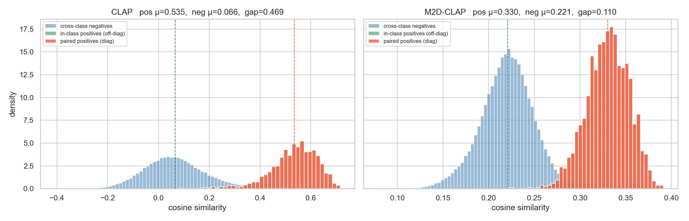
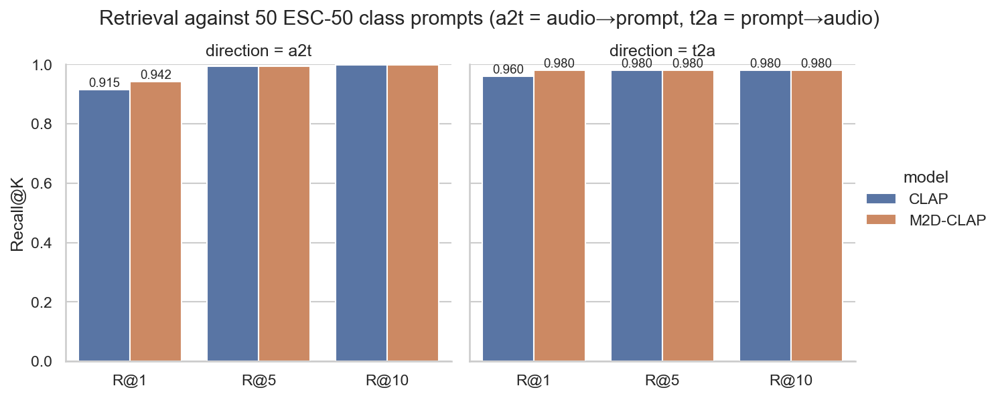
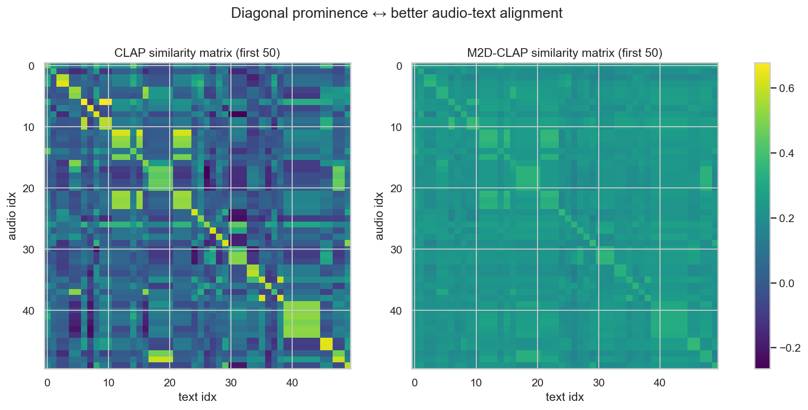

# CLAP vs M2D-CLAP — Audio-Text Matching Comparison

A reproducible side-by-side study of two contrastive audio-language models on
**audio-text matching**:

- **CLAP** (LAION-AI, 2023) — `laion-clap` package, the public `enable_fusion=False` checkpoint  
  Wu et al. *“Large-scale Contrastive Language-Audio Pretraining with Feature Fusion and Keyword-to-Caption Augmentation”*, ICASSP 2023.
- **M2D-CLAP$_{2025}$** (NTT CSL, 2025) — `m2d_clap_vit_base-80x1001p16x16p16kpBpTI-2025` (journal release)  
  Niizumi et al. *“M2D-CLAP: Exploring General-purpose Audio-Language Representations Beyond CLAP”*, **IEEE Access** 2025.

Both models are evaluated on the **same** ESC-50 audio set with the **same** prompts so the only thing that changes between runs is the encoder pair.

---

## TL;DR — Headline numbers

ESC-50 (2,000 clips, 50 balanced classes; prompts: `"This is a sound of {class}."`):

| Metric                                | CLAP   | M2D-CLAP | Δ |
|---------------------------------------|:------:|:--------:|:-:|
| Zero-shot top-1                       | 0.9150 | **0.9415** | **+2.7%** |
| Zero-shot top-5                       | 0.9935 | **0.9950** | +0.2% |
| Audio→Prompts R@1                     | 0.9150 | **0.9415** | +2.7% |
| Audio→Prompts R@5                     | 0.9935 | **0.9950** | +0.2% |
| Prompts→Audio R@1 (multi-positive)    | 0.9600 | **0.9800** | +2.0% |
| Paired cosine μ (positives)           | 0.535  | 0.330    | — *(not directly comparable, raw scale differs)* |
| Cross-class cosine μ (negatives)      | 0.066  | 0.221    | — |
| Gap (positive − negative)             | **0.469** | 0.110 | CLAP has the wider raw cosine gap |

**Reading the result.** M2D-CLAP wins the *ranking* tasks (top-1 / R@1) by a
small but consistent ~2-3% on top of an already very strong CLAP baseline. CLAP
puts positives and negatives much further apart in raw cosine space (its
similarity heatmap is visibly more “blocky”), but M2D-CLAP — despite living in
a tighter slice of the unit sphere — orders the items more accurately, which
is what retrieval / classification actually depend on.







### Where the gain comes from

Top classes where M2D-CLAP improves most on CLAP (per-class top-1 acc):

| class            | CLAP  | M2D-CLAP | Δ |
|------------------|:-----:|:--------:|:-:|
| insects          | 0.275 | 0.900    | **+0.625** |
| washing_machine  | 0.550 | 0.800    | +0.250 |
| wind             | 0.425 | 0.575    | +0.150 |
| crickets         | 0.575 | 0.675    | +0.100 |
| rooster          | 0.875 | 0.975    | +0.100 |

…and where CLAP still wins:

| class      | CLAP  | M2D-CLAP | Δ |
|------------|:-----:|:--------:|:-:|
| rain       | 0.950 | 0.800    | −0.150 |
| airplane   | 0.950 | 0.825    | −0.125 |
| can_opening| 0.950 | 0.850    | −0.100 |

Classes with rich training-data coverage in M2D-CLAP’s mix (AudioSet + VGGSound + WavCaps + AudioCaps + Clotho) — animals, mechanical hum — get the biggest boost; broader environmental textures favour CLAP slightly. See `results/figures/per_class_top1.png` for the full sorted bar chart.

> **Why we don’t report 2000-vs-2000 retrieval.** ESC-50 has 40 audios per class
> sharing one caption (`"This is a sound of dog."`). In an N×N retrieval matrix
> these 40 captions are duplicates, so depending on how identical floats are
> ordered the “diagonal” caption ends up at rank 0 (CLAP) or scattered through
> ranks 0–39 (M2D-CLAP, due to BERT batching jitter). That artifact has nothing
> to do with audio-text quality, so we instead report retrieval against the 50
> **unique** class prompts — which is the apples-to-apples setup on ESC-50 and
> coincides with zero-shot top-K accuracy.

---

## Project layout

```
audio-text-clap-vs-m2d-clap/
├── data/                                   ← ESC-50 lives here (gitignored)
│   ├── ESC-50-master/                      ← unpacked from karolpiczak/ESC-50
│   └── esc50_metadata.csv                  ← (audio_path, caption, class_name, target, fold)
├── checkpoints/                            ← M2D-CLAP weights (gitignored, 1.6 GB)
│   └── m2d_clap_vit_base-80x1001p16x16p16kpBpTI-2025/checkpoint-30.pth
├── src/
│   ├── portable_m2d.py                     ← vendored runtime from nttcslab/m2d
│   ├── download_m2d_weights.py             ← fetch + extract M2D-CLAP_2025 zip (1.47 GB)
│   ├── download_esc50.py                   ← fetch ESC-50 + build metadata CSV
│   ├── extract_clap.py                     ← LAION-CLAP encoder → results/clap/*.npy
│   ├── extract_m2d_clap.py                 ← PortableM2D encoder → results/m2d_clap/*.npy
│   ├── analyze.py                          ← retrieval / zero-shot / plotting helpers
│   └── run_compare.py                      ← headless re-run of the whole comparison
├── notebooks/
│   ├── 01_extract_clap.ipynb
│   ├── 02_extract_m2d_clap.ipynb
│   └── 03_compare.ipynb                    ← the deliverable
├── results/
│   ├── clap/                               ← audio_emb, text_emb, class_text_emb, metadata
│   ├── m2d_clap/                           ← same, 768-d instead of 512-d
│   └── figures/                            ← all pngs / csvs the README pulls in
└── requirements.txt
```

---

## Reproducing the comparison from scratch

Everything below was tested on macOS 14 (M-series, MPS backend). On a CUDA box
swap the torch wheel for a CUDA build and replace `mps` with `cuda` automatically.

### 1. Environment

```bash
conda create -n clap_vs_m2d python=3.10 -y
conda activate clap_vs_m2d
pip install -r requirements.txt
```

### 2. Download the M2D-CLAP weights (~1.47 GB zip → 1.69 GB checkpoint)

```bash
python src/download_m2d_weights.py
```

Source: <https://github.com/nttcslab/m2d/releases/tag/v0.5.0>

### 3. Download the ESC-50 dataset (~600 MB)

```bash
python src/download_esc50.py
```

Source: <https://github.com/karolpiczak/ESC-50>. This also writes
`data/esc50_metadata.csv` with the prompt template
`"This is a sound of {class_name}."`.

### 4. Extract embeddings (≈ 90s + 40s on Apple M-series)

```bash
python src/extract_clap.py        --batch_size 32
python src/extract_m2d_clap.py    --audio_batch 8
```

Each writes a 4-file bundle into `results/{clap,m2d_clap}/`:
- `audio_embeddings.npy` shape `(N, 512)` for CLAP, `(N, 768)` for M2D-CLAP
- `text_embeddings.npy` aligned 1-to-1 with audio
- `class_text_embeddings.npy` shape `(50, D)` for zero-shot
- `metadata.csv` and `class_names.txt`

### 5. Run the comparison

Either headlessly:

```bash
python src/run_compare.py
```

…or interactively:

```bash
jupyter notebook notebooks/03_compare.ipynb
```

Both write the same figures + CSVs into `results/figures/`.

---

## Swap in your own dataset

Any CSV with columns `audio_path,caption` works for the per-clip retrieval
metrics. If you also include `class_name`, the scripts will additionally save
class-level prompt embeddings and produce zero-shot results. Example:

```bash
python src/extract_clap.py     --csv path/to/my_dataset.csv --out results/clap_mydata
python src/extract_m2d_clap.py --csv path/to/my_dataset.csv --out results/m2d_clap_mydata
```

---

## Citations

```bibtex
@article{niizumi2025m2d-clap,
  author  = {Niizumi, Daisuke and Takeuchi, Daiki and Yasuda, Masahiro and Nguyen, Binh Thien and Ohishi, Yasunori and Harada, Noboru},
  journal = {IEEE Access},
  title   = {{M2D-CLAP: Exploring General-purpose Audio-Language Representations Beyond CLAP}},
  year    = {2025},
  volume  = {13},
  pages   = {163313-163330},
  doi     = {10.1109/ACCESS.2025.3611348}
}

@inproceedings{wu2023clap,
  title     = {Large-scale Contrastive Language-Audio Pretraining with Feature Fusion and Keyword-to-Caption Augmentation},
  author    = {Yusong Wu and Ke Chen and Tianyu Zhang and Yuchen Hui and Taylor Berg-Kirkpatrick and Shlomo Dubnov},
  booktitle = {ICASSP},
  year      = {2023}
}

@inproceedings{piczak2015esc,
  title     = {ESC: Dataset for Environmental Sound Classification},
  author    = {Piczak, Karol J.},
  booktitle = {ACM Multimedia},
  year      = {2015}
}
```

---

## License & attribution

- `src/portable_m2d.py` is vendored verbatim from <https://github.com/nttcslab/m2d>
  (NTT Communication Science Laboratories). All rights belong to the original
  authors; please refer to the upstream repo for license terms.
- LAION-AI CLAP is consumed via the `laion-clap` PyPI package; checkpoints are
  downloaded by the package itself on first use.
- ESC-50 audio is downloaded directly from
  <https://github.com/karolpiczak/ESC-50> (CC BY-NC 4.0 with per-clip
  attribution in `meta/esc50.csv`).
- Code in this repository is released under the MIT license (see `LICENSE`).
